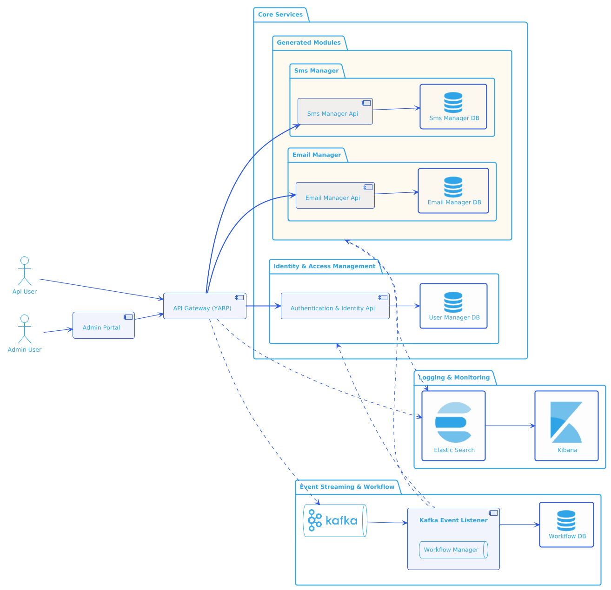
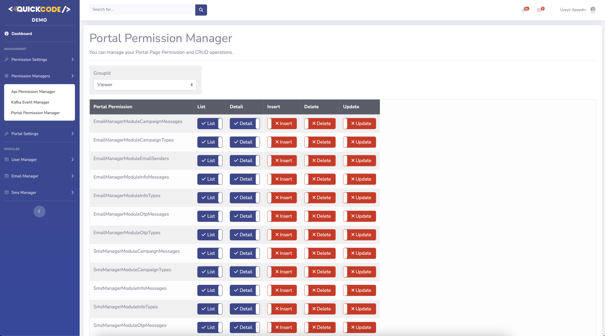

# Demo Solution

[](https://dotnet.microsoft.com/)
[](https://www.docker.com/)
[](https://cloud.google.com/run)
[](LICENSE)

## Table of Contents

1. [About the Solution](#about-the-solution)
2. [Technologies & Stack](#technologies--stack)
3. [Solution & Module Structure](#solution--module-structure)
    - [3.1. Solution Overview & Architecture Diagram](#31-solution-overview--architecture-diagram)
    - [3.2. Module Descriptions](#32-module-descriptions)
    - [3.3. Gateway & Portal Dashboards](#33-gateway--portal-dashboards)
    - [3.4. Domain & Routing](#34-domain--routing)
    - [3.5. Advanced Features](#35-advanced-features)
        - [Gateway API Monitoring & Kafka Integration](#gateway-api-monitoring--kafka-integration)
        - [Custom Workflows with YAML Configuration](#custom-workflows-with-yaml-configuration)
        - [User Group-Based Api Management](#user-group-based-api-management)
        - [Management Screens](#management-screens)
4. [Setup & Run](#setup--run)
    - [4.1. Running with Docker](#41-running-with-docker)
    - [4.2. Local Development](#42-local-development)
5. [Running Tests](#running-tests)
6. [CI/CD & Cloud Run Deployment](#cicd--cloud-run-deployment)
7. [Developer Notes & Extras](#developer-notes--extras)
    - [7.1. Environment Variables & Secrets](#71-environment-variables--secrets)
    - [7.2. Code Quality & Standards](#72-code-quality--standards)
    - [7.3. Contributing](#73-contributing)
8. [FAQ](#faq)
9. [Contact](#contact)

---

## 1. About the Solution

**Demo** is a modular, enterprise-grade .NET solution generated by [quickcode.net](https://quickcode.net).  
It is designed for scalable, maintainable, and testable microservice architectures, supporting Docker, CI/CD, and Google Cloud Run deployment.

---

## 2. Technologies & Stack

- **.NET 9** (C#)
- **Entity Framework Core**
- **PostgreSQL / SQL Server / MySQL Support**
- **Docker & Docker Compose**
- **Google Cloud Run**
- **GitHub Actions (CI/CD)**
- **Custom mediator for CQRS**
- **Swagger/OpenAPI**
- **Serilog, HealthChecks, etc.**

---

## 3. Solution & Module Structure

### 3.1. Solution Overview & Architecture Diagram

```
demo/
  src/
    Common/
    Modules/
      .../  
      other modules
      .../ 
      UserManagerModule/
    Presentation/
      QuickCode.Demo.Gateway/
      QuickCode.Demo.Portal/
    Services/
    ...
  docker-compose.yml
  README.md
```
- Architecture Diagram:
  

### 3.2. Module Descriptions

- **UserManagerModule:** User, role, and permission management.
- **Gateway:** API gateway and reverse proxy.
- **Portal:** Web frontend (MVC/Razor).

### 3.3. Gateway & Portal Dashboards

QuickCode projects include ready-to-use management dashboards for both Gateway and Portal:

- **Gateway Dashboard:**
    - Central entry point for all APIs and modules
    - Health checks, Swagger Map, config management, and quick links to Portal, Kibana, Kafdrop, and GitHub
    - Your project: e.g. [https://demo-gateway.quickcode.net](https://demo-gateway.quickcode.net)
    
  
- **Portal Dashboard:**
    - Admin interface for managing all tables, users, roles, permissions, and workflows
    - Secure login, user management, and event/workflow configuration
    - Demo user credentials:
      - Username : demo@quickcode.net
      - Password : String1!
    - Your project: e.g. [https://demo-portal.quickcode.net](https://demo-portal.quickcode.net)
    
  
These dashboards are automatically deployed and available for every generated project, providing a unified and professional management experience out of the box.

### 3.4. Domain & Routing

All services and modules are deployed to Google Cloud Run and exposed via user-friendly, corporate domains ending with `.quickcode.net` for a seamless and professional experience.

- **Gateway:**
    - link: [https://demo-gateway.quickcode.net](https://demo-gateway.quickcode.net)
- **Portal:**
    - link: [https://demo-portal.quickcode.net](https://demo-portal.quickcode.net)
- **Module APIs:**
    - link: [https://demo-user-manager-modul.quickcode.net](https://demo-user-manager-modul.quickcode.net)
    - etc.

#### Gateway Routing
- The Gateway automatically routes requests to the correct module API based on the path and host.
- Swagger, health check, and module API endpoints are all mapped and accessible via the Gateway domain.
- All routing and cluster configuration is managed for you; see the sample below:

```json
{
  "Routes": {
    "user-manager-module": {
      "Match": {
        "Hosts": ["demo-gateway.quickcode.net"],
        "Path": "api/user-manager-module/{**catch-all}"
      },
      "ClusterId": "user-manager-module-api"
    }
  },
  "Clusters": {
    "user-manager-module-api": {
      "Destinations": {
        "destination1": {
          "Address": "https://demo-user-manager-module.quickcode.net"
        }
      }
    }
  }
}
```

This ensures all APIs and dashboards are accessible via clean, memorable URLs, both in demo and production environments.

### 3.5. Advanced Features

#### Gateway API Monitoring & Kafka Integration

- **API Call Tracking:** Every API call passing through the Gateway is monitored and logged
- **Predefined Topics:** Kafka integration with predefined topics for different types of API calls
- **Real-time Monitoring:** Track API performance, usage patterns, and system health
- **Event Streaming:** All API events are streamed to Kafka for real-time processing

#### Custom Workflows with YAML Configuration

- **YAML-based Workflow Definition:** Create custom workflows using simple YAML configuration
- **Endpoint Integration:** Workflows can trigger API calls to any endpoint
- **Topic-based Processing:** Workflows can subscribe to Kafka topics and process events
- **Dynamic Execution:** Workflows can be modified and deployed without code changes

#### User Group-Based Api Management

- **Endpoint-Level Permissions:** Configure access control for each API endpoint based on user groups
- **Portal Page Management:** Granular control over portal pages and CRUD operations per user group
- **Dynamic Authorization:** Real-time permission updates without system restart
- **Audit Trail:** Complete logging of all permission changes and access attempts

#### Management Screens

- **Gateway Management:** Configure API routes, permissions, and monitoring settings
- **Portal Management:** Manage user groups, page access, and CRUD permissions
- **Workflow Management:** Create, edit, and monitor custom workflows
- **Kafka Topic Management:** Monitor and configure Kafka topics and event processing

These features provide enterprise-level control and monitoring capabilities, making the system suitable for large-scale deployments with complex permission requirements.

---

## 4. Setup & Run

### 4.1. Running with Docker

#### On macOS and Linux
```bash
docker compose up --build
```
> **Note:**
> - On macOS and most modern Linux distributions, use `docker compose up --build` (with a space).
> - Docker Compose v2 (the space version) is included with Docker Desktop and most recent Docker installations.
    > [Install Docker Desktop](https://www.docker.com/products/docker-desktop/) if you haven't already.

#### On Windows (or older Docker installations)
```bash
docker-compose up --build
```
> **Note:**
> - On Windows or with older Docker installations, use `docker-compose up --build` (with a dash).
> - If you get an error, try the macOS/Linux command above.

2. **Access the main services:**
    - **Portal:** http://localhost:6020
    - **Gateway:** http://localhost:6010
    - **APIs:** Each module exposes its own API (see docker-compose for ports).

3. **Stop all services:**
   ```bash
   docker-compose down
   ```

### 4.2. Local Development

- You can run individual modules locally using Visual Studio or `dotnet run`.
- Make sure required environment variables and connection strings are set (see [Environment Variables & Secrets](#71-environment-variables--secrets)).

---

## 5. Running Tests

- **Unit & Integration Tests:**
  ```bash
  dotnet test QuickCode.Demo.sln
  ```
- **Code Coverage:**
  ```bash
  ./run-coverage-report.sh
  ```
  Coverage reports are generated in the `coverage-report/` directory.

  **Note:** The coverage script:
    - Excludes DTOs from coverage (`[*.Dtos]*`)
    - Excludes Common, Portal, and Gateway projects from coverage
    - Generates HTML reports in `coverage-report/index.html`

---

## 6. CI/CD & Cloud Run Deployment

- **GitHub Actions** is used for CI/CD.
- On every push or pull request, tests and builds are run automatically.
- On merge to `main`, Docker images are built and pushed to Google Container Registry.
- **Automatic deployment to Google Cloud Run** is triggered after a successful build.
- All secrets and environment variables are managed via **GitHub Secrets** and **GCP environment variables**.
  

**Example Workflow:**
1. Developer pushes code to GitHub.
2. GitHub Actions runs tests, builds, and coverage.
3. If on `main`, Docker images are built and pushed.
4. Cloud Run is updated with the new image.
5. Health checks and notifications are performed.

---

## 7. Developer Notes & Extras

### 7.1. Environment Variables & Secrets

- All sensitive data (connection strings, API keys) are managed via environment variables.
- **Never commit secrets to the repository.**
- For local development, use a `.env` file (excluded from git).

### 7.2. Code Quality & Standards

- Follows Clean Architecture and SOLID principles.
- Uses CQRS, repository, and dependency injection patterns.
- Linting, analyzers, and code coverage are integrated.

### 7.3. Contributing

- Fork the repository and create a feature branch.
- Write tests for your changes.
- Open a pull request with a clear description.

---

## 8. FAQ

**Q:** How do I add a new module?  
**A:** Go to [quickcode.net](https://quickcode.net), enter your project secret, and regenerate your project. The new module will be included in the updated codebase.

**Q:** How do I update secrets?  
**A:** If you are the project owner on GitHub, you can add secrets there. Otherwise, all secrets are managed by quickcode.net.

**Q:** How do I troubleshoot a failing service?  
**A:** Check logs with `docker-compose logs <service>`, and review health check endpoints.

---

## 9. Contact

**Project Owner:** Üzeyir Apaydın
- LinkedIn: [linkedin.com/in/uzeyirapaydin](https://linkedin.com/in/uzeyirapaydin)
- GitHub: [github.com/uzeyirapaydin](https://github.com/uzeyirapaydin) or [github.com/QuickCodeNet](https://github.com/QuickCodeNet)
- Email: uzeyir@quickcode.net

For enterprise solutions, collaboration, or technical discussions, please reach out.

---


**Feel free to reach out or open an issue for further questions!** 