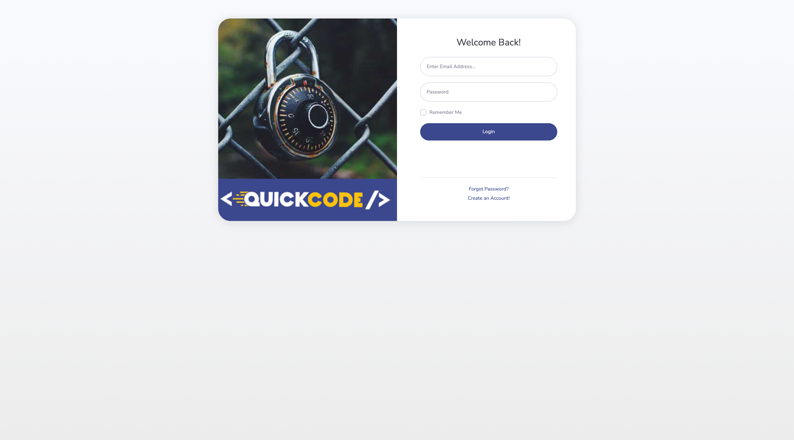
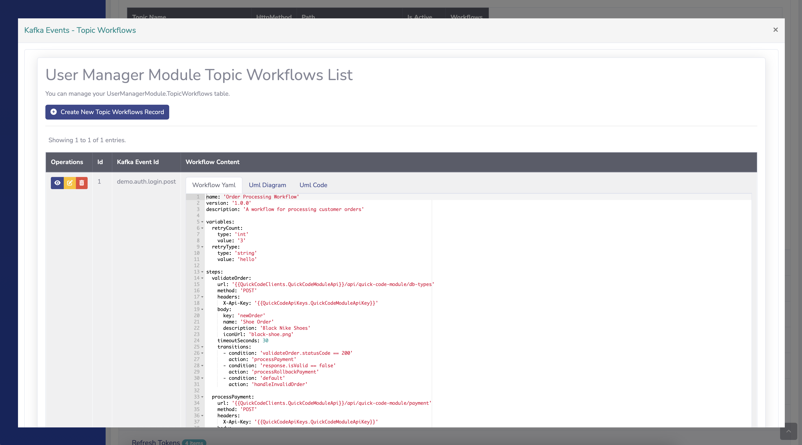
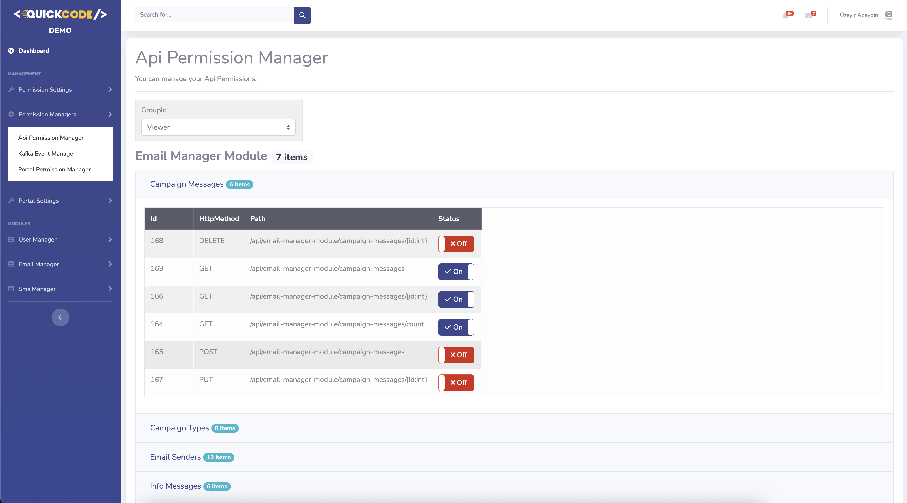
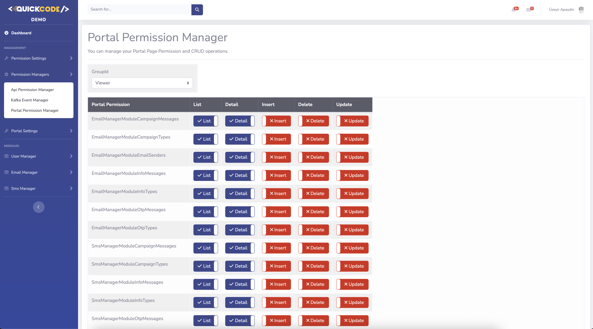

# 🚀 Demo - Generated Microservice Platform

> **Ready-to-Deploy Microservices**  
> *Generated with [QuickCode.Net](https://quickcode.net) • Deployed on Google Cloud Run • CI/CD with GitHub Actions • Containerized with Docker • Event-driven with Kafka • Monitored with Elasticsearch & Kibana*

> **Design, Visualize, Code, Deploy**

[](https://dotnet.microsoft.com/)
[](https://www.docker.com/)
[](https://github.com/features/actions)
[](https://cloud.google.com/run)
[](https://www.postgresql.org/)
[](https://www.microsoft.com/sql-server)
[](https://www.mysql.com/)
[](https://kafka.apache.org/)
[](https://www.elastic.co/elasticsearch)
[](https://www.elastic.co/kibana)
[](https://docs.microsoft.com/ef/)
[](https://docs.microsoft.com/azure/architecture/patterns/cqrs)
[](LICENSE)
## Table of Contents

- [Onboarding Checklist](#onboarding-checklist)

1. [About the Solution](#about-the-solution)
2. [Technologies & Stack](#technologies--stack)
3. [Solution & Module Structure](#solution--module-structure)
    - [3.1. Solution Overview & Architecture Diagram](#31-solution-overview--architecture-diagram)
    - [3.2. Module Descriptions](#32-module-descriptions)
    - [3.3. Gateway & Portal Dashboards](#33-gateway--portal-dashboards)
    - [3.4. Domain & Routing](#34-domain--routing)
    - [3.5. Advanced Features](#35-advanced-features)
        - [Gateway API Monitoring & Kafka Integration](#gateway-api-monitoring--kafka-integration)
        - [Custom Workflows with YAML Configuration](#custom-workflows-with-yaml-configuration)
        - [User Group-Based Api Management](#user-group-based-api-management)
        - [Management Screens](#management-screens)
4. [Setup & Run](#setup--run)
    - [4.1. Running with Docker](#41-running-with-docker)
    - [4.2. Local Development](#42-local-development)
5. [Running Tests](#running-tests)
6. [CI/CD & Cloud Run Deployment](#cicd--cloud-run-deployment)
7. [Developer Notes & Extras](#developer-notes--extras)
    - [7.1. Environment Variables & Secrets](#71-environment-variables--secrets)
    - [7.2. Code Quality & Standards](#72-code-quality--standards)
    - [7.3. Contributing](#73-contributing)
8. [FAQ](#8-faq)
    - [How do I add a new module?](#how-do-i-add-a-new-module)
    - [How do I update secrets?](#how-do-i-update-secrets)
    - [How do I troubleshoot a failing service?](#how-do-i-troubleshoot-a-failing-service)
9. [Contact](#9-contact)

---

## 🚀 Onboarding Checklist

### 1. Install Prerequisites
- [ ] **Docker Desktop** (or Docker Engine) is installed and running  
  [Download Docker Desktop](https://www.docker.com/products/docker-desktop/)
- [ ] **.NET 9 SDK** is installed  
  [Download .NET 9 SDK](https://dotnet.microsoft.com/en-us/download/dotnet/9.0)
- [ ] **Git** is installed  
  [Download Git](https://git-scm.com/downloads)

### 2. Clone the Repository
- [ ] Open a terminal and run:
  ```bash
  git clone https://github.com/QuickCodeNet/demo.git
  ```

  ```bash
  cd demo
  ```

### 3. Configure Environment Variables
- [ ] If required, copy `.env.example` to `.env` and fill in any necessary secrets or API keys  
  (If `.env.example` does not exist, check the README or ask the project owner for required environment variables.)

### 4. Build and Start the Project
- [ ] Start all services with Docker:
    - On **macOS/Linux**:
      ```bash
      docker compose up --build
      ```
    - On **Windows**:
      ```bash
      docker-compose up --build
      ```
- [ ] Wait until all containers are up and healthy (check terminal output for errors).

### 5. Access the Application
- [ ] Open your browser and go to:
    - **Portal:** [http://localhost:6020](http://localhost:6020)
    - **Gateway:** [http://localhost:6060](http://localhost:6060)
- [ ] Log in to the Portal using demo credentials (if provided):
    - **Username:** demo@quickcode.net
    - **Password:** String1!

### 6. Run Tests and Check Code Coverage
- [ ] In a new terminal, run all tests:
  ```bash
  dotnet test QuickCode.Demo.Docker.sln
  ```
- [ ] Generate a code coverage report:
  ```bash
  ./run-coverage-report.sh
  ```
- [ ] Open `coverage-report/index.html` in your browser to review the results.

### 7. Explore the System
- [ ] Visit the **Gateway Dashboard** and check available modules and health checks.
- [ ] In the **Portal**, try user, role, permission, and workflow management features.
- [ ] Review logs and monitoring dashboards (Kibana, Elastic) if available.

### 8. Development Workflow
- [ ] Create a new branch for your feature or bugfix:
  ```bash
  git checkout -b feature/my-feature
  ```
- [ ] Make your changes, commit, and push:
  ```bash
  git add .
  git commit -m "Describe your changes"
  git push origin feature/my-feature
  ```
- [ ] Open a Pull Request on GitHub.

### 9. CI/CD and Deployment
- [ ] Check GitHub Actions for automated build and deployment status.
- [ ] Review Cloud Run deployment logs if you have access.


---

## 1. About the Solution

**Demo** is a modular, enterprise-grade .NET solution generated by [quickcode.net](https://quickcode.net).  
It is designed for scalable, maintainable, and testable microservice architectures, supporting Docker, CI/CD, and Google Cloud Run deployment.

---

## 2. Technologies & Stack

- **.NET 9** (C#)
- **Entity Framework Core**
- **PostgreSQL / SQL Server / MySQL Support**
- **Docker & Docker Compose**
- **Google Cloud Run**
- **GitHub Actions (CI/CD)**
- **Custom mediator for CQRS**
- **Swagger/OpenAPI**
- **Serilog, HealthChecks, etc.**

---

## 3. Solution & Module Structure

### 3.1. Solution Overview & Architecture Diagram

```
demo/
  src/
    Common/
    Modules/
      .../  
      other modules
      .../ 
      UserManagerModule/
    Presentation/
      QuickCode.Demo.Gateway/
      QuickCode.Demo.Portal/
    Services/
    ...
  docker-compose.yml
  README.md
```
- Architecture Diagram:
  

### 3.2. Module Descriptions

- **UserManagerModule:** User, role, and permission management.
- **Gateway:** API gateway and reverse proxy.
- **Portal:** Web frontend (MVC/Razor).

### 3.3. Gateway & Portal Dashboards

QuickCode projects include ready-to-use management dashboards for both Gateway and Portal:

- **Gateway Dashboard:**
    - Central entry point for all APIs and modules
    - Health checks, Swagger Map, config management, and quick links to Portal, Kibana, Kafdrop, and GitHub
    - Your project: e.g. [https://demo-gateway.quickcode.net](https://demo-gateway.quickcode.net)
      

- **Portal Dashboard:**
    - Admin interface for managing all tables, users, roles, permissions, and workflows
    - Secure login, user management, and event/workflow configuration
    - Demo user credentials:
        - Username : demo@quickcode.net
        - Password : String1!
    - Your project: e.g. [https://demo-portal.quickcode.net](https://demo-portal.quickcode.net)
      

These dashboards are automatically deployed and available for every generated project, providing a unified and professional management experience out of the box.

### 3.4. Domain & Routing

All services and modules are deployed to Google Cloud Run and exposed via user-friendly, corporate domains ending with `.quickcode.net` for a seamless and professional experience.

- **Gateway:**
    - link: [https://demo-gateway.quickcode.net](https://demo-gateway.quickcode.net)
- **Portal:**
    - link: [https://demo-portal.quickcode.net](https://demo-portal.quickcode.net)
- **Module APIs:**
    - link: [https://demo-user-manager-module.quickcode.net](https://demo-user-manager-module.quickcode.net)
    - etc.

#### Gateway Routing
- The Gateway automatically routes requests to the correct module API based on the path and host.
- Swagger, health check, and module API endpoints are all mapped and accessible via the Gateway domain.
- All routing and cluster configuration is managed for you; see the sample below:

```json
{
  "Routes": {
    "user-manager-module": {
      "Match": {
        "Hosts": ["demo-gateway.quickcode.net"],
        "Path": "api/user-manager-module/{**catch-all}"
      },
      "ClusterId": "user-manager-module-api"
    }
  },
  "Clusters": {
    "user-manager-module-api": {
      "Destinations": {
        "destination1": {
          "Address": "https://demo-user-manager-module.quickcode.net"
        }
      }
    }
  }
}
```

This ensures all APIs and dashboards are accessible via clean, memorable URLs, both in demo and production environments.

### 3.5. Advanced Features

#### Gateway API Monitoring & Kafka Integration

- **API Call Tracking:** Every API call passing through the Gateway is monitored and logged
- **Predefined Topics:** Kafka integration with predefined topics for different types of API calls
- **Real-time Monitoring:** Track API performance, usage patterns, and system health
- **Event Streaming:** All API events are streamed to Kafka for real-time processing

#### Custom Workflows with YAML Configuration

- **YAML-based Workflow Definition:** Create custom workflows using simple YAML configuration
- **Endpoint Integration:** Workflows can trigger API calls to any endpoint
- **Topic-based Processing:** Workflows can subscribe to Kafka topics and process events
- **Dynamic Execution:** Workflows can be modified and deployed without code changes

#### User Group-Based Api Management

- **Endpoint-Level Permissions:** Configure access control for each API endpoint based on user groups
- **Portal Page Management:** Granular control over portal pages and CRUD operations per user group
- **Dynamic Authorization:** Real-time permission updates without system restart
- **Audit Trail:** Complete logging of all permission changes and access attempts

#### Management Screens

- **Gateway Management:** Configure API routes, permissions, and monitoring settings
- **Portal Management:** Manage user groups, page access, and CRUD permissions
- **Workflow Management:** Create, edit, and monitor custom workflows
- **Kafka Topic Management:** Monitor and configure Kafka topics and event processing

These features provide enterprise-level control and monitoring capabilities, making the system suitable for large-scale deployments with complex permission requirements.

---

## 4. Setup & Run

### 4.1. Quick Start with Docker

**On macOS and Linux:**
```bash
docker compose up --build
```

**On Windows (or older Docker installations):**
```bash
docker-compose up --build
```

**Access the services:**
- **Portal:** http://localhost:6020
- **Gateway:** http://localhost:6060

> **Note:** For detailed step-by-step instructions, see the [Onboarding Checklist](#onboarding-checklist) above.

### 4.2. Local Development

- You can run individual modules locally using Visual Studio or `dotnet run`.
- Make sure required environment variables and connection strings are set (see [Environment Variables & Secrets](#71-environment-variables--secrets)).

---

## 5. Running Tests

- **Unit & Integration Tests:**
  ```bash
  dotnet test QuickCode.Demo.docker.sln
  ```
- **Code Coverage:**
  ```bash
  ./run-coverage-report.sh
  ```
  Coverage reports are generated in the `coverage-report/` directory.

  **Note:** The coverage script:
    - Excludes DTOs from coverage (`[*.Dtos]*`)
    - Excludes Common, Portal, and Gateway projects from coverage
    - Generates HTML reports in `coverage-report/index.html`

---

## API Testing with Postman Collections

Ready-to-use Postman collections are provided for all modules in this project. This enables you to quickly test and explore every API endpoint.

### How to Use

1. **Import All Collections:**
    - In Postman, click **Import** and select all JSON files from the `src/postman_files` directory.
    - You will see collections for the **User Manager API** and other modules (such as Email Manager Module, Sms Manager Module , etc.).

2. **Authentication Flow:**
    - Each collection contains an **Authentication** folder with a `Login` request.
    - Run the `Login` request first.
        - The test script in this request will automatically save the `access_token` (or `token`) to your Postman environment.

3. **Environment Setup:**
    - Make sure you have a Postman environment with a `token` variable (it will be set automatically after login).
    - Optionally, set a `baseUrl` variable if your API base URL is different from the default.

4. **Test Any Endpoint:**
    - After logging in, you can immediately test any endpoint in any collection.
    - All requests use the token automatically via the `Authorization: Bearer {{token}}` header.

---

### Example Workflow

1. **Import all collections from `src/postman_files`.**
2. **Select or create a Postman environment.**
3. **Run the `Login` request in the `Authentication` folder of the User Manager API or any other module.**
4. **The token is saved to the environment.**
5. **You can now use all other endpoints in all collections without manually copying tokens.**

---

### Notes

- All collections are automatically generated from the latest Swagger/OpenAPI definitions, ensuring they are always up to date.
- If your token expires or you get a 401 error, simply re-run the `login` request to refresh your token.

---

**This setup makes onboarding, testing, and integration with your APIs fast and reliable for all developers and partners.**

---

## 6. CI/CD & Cloud Run Deployment

- **GitHub Actions** is used for CI/CD.
- On every push or pull request, tests and builds are run automatically.
- On merge to `main`, Docker images are built and pushed to Google Container Registry.
- **Automatic deployment to Google Cloud Run** is triggered after a successful build.
- All secrets and environment variables are managed via **GitHub Secrets** and **GCP environment variables**.
  

**Example Workflow:**
1. Developer pushes code to GitHub.
2. GitHub Actions runs tests, builds, and coverage.
3. If on `main`, Docker images are built and pushed.
4. Cloud Run is updated with the new image.
5. Health checks and notifications are performed.

---

## 7. Developer Notes & Extras

### 7.1. Environment Variables & Secrets

- All sensitive data (connection strings, API keys) are managed via environment variables.
- **Never commit secrets to the repository.**
- For local development, use a `.env` file (excluded from git).

### 7.2. Code Quality & Standards

- Follows Clean Architecture and SOLID principles.
- Uses CQRS, repository, and dependency injection patterns.
- Linting, analyzers, and code coverage are integrated.

### 7.3. Contributing

- Fork the repository and create a feature branch.
- Write tests for your changes.
- Open a pull request with a clear description.

---

## 8. FAQ

**Q:** How do I add a new module?  
**A:** Go to [quickcode.net](https://quickcode.net), enter your project secret, and regenerate your project. The new module will be included in the updated codebase.

**Q:** How do I update secrets?  
**A:** If you are the project owner on GitHub, you can add secrets there. Otherwise, all secrets are managed by quickcode.net.

**Q:** How do I troubleshoot a failing service?  
**A:** Check logs with `docker-compose logs <service>`, and review health check endpoints.

---

## 9. Contact

**Project Owner:** Üzeyir Apaydın
- LinkedIn: [linkedin.com/in/uzeyirapaydin](https://linkedin.com/in/uzeyirapaydin)
- GitHub: [github.com/uzeyirapaydin](https://github.com/uzeyirapaydin) or [github.com/QuickCodeNet](https://github.com/QuickCodeNet)
- Email: uzeyir@quickcode.net

For enterprise solutions, collaboration, or technical discussions, please reach out.

---


**Feel free to reach out or open an issue for further questions!**

**Last generation Time**: [Generated on: 2025-10-26 14:30:28 UTC]